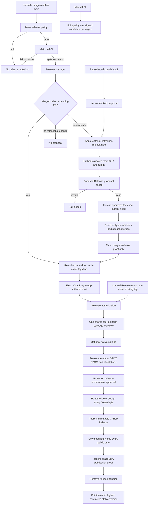

# Client release policy

Camellia Nexus client and management-server versions advance independently. The client publishes canonical stable Semantic Versions only. `[workspace.package].version` in the root `Cargo.toml` is the sole committed version source; workspace crates and Tauri packages inherit it, and Cargo owns `Cargo.lock`.

GitHub Release is the primary trusted distribution surface. The workflow derives repository owner, repository name and URLs from the current GitHub context and operates on the standard remote created by Actions checkout; no account, developer-local alternate remote or GitHub App name is compiled into the release logic.

Actions names are repository-local and responsibility-based: `Main`, `CI`, `Merge`, `Release Manager`, `Packages` and `Release`. `CI / Required` is the single stable required check. Repository-local controls implement the CI/CD baseline in the organization governance repository; the organization policy audit detects hosted-setting and required-workflow drift without replacing the product-specific gates described here.

## Release flow



The release manager is serialized and idempotent. It recovers the oldest merged `release:pending` PR before proposing another release. Absent, tag-only, draft and published states have explicit transitions; draft creation always precedes tag publication, and a bounded reconciliation advances both resources to a remotely verified prepared state in one invocation. Each mutation is issued once, followed by bounded authoritative observation until its resulting transition is visible; non-convergence and conflicting states fail closed, while an interrupted invocation resumes from the surviving resource. API failures are never interpreted as resource absence, and conflicting tags, Releases, assets or identities stop the workflow. A published Release is not considered operationally complete until its exact-SHA `release-complete` marker has been written after public asset readback. Before any release mutation, the manager verifies merge, immutable-Release and Actions settings, including full-SHA action pinning and the read-only non-approving workflow-token defaults.

Every version recorded by the canonical top Changelog section is permanently consumed. Deleting or losing its tag or Release never makes that version reusable; [GitHub immutable Releases also reserve a published tag name permanently, including after deletion](https://docs.github.com/en/code-security/concepts/supply-chain-security/immutable-releases). The manager treats the commit that introduced the recorded section as the release baseline, considers only later commits for the next version and generated notes, and fails if a same-named tag points elsewhere. A temporary local tag may represent a missing baseline only while git-cliff calculates the next version; it is deleted immediately and is never pushed.

| Observed authoritative state | Required reconciliation |
| --- | --- |
| Pending merged release with no tag and no Release | Create the App-authored draft, then create the exact-SHA tag and re-read both |
| Recorded version without its managed resources and without a pending recovery | Preserve the consumed version and propose only a newer version from commits after its recorded baseline |
| Draft without tag | Create only the exact-SHA tag, then re-read both |
| Tag without Release | Create only the matching App-authored draft, then re-read both |
| Matching tag and draft | Keep `release:pending`; the tag workflow owns package publication |
| Public Release without completion proof | Keep `release:pending`; rerun the exact tag workflow to verify every public artifact and record proof |
| Public Release with completion proof | Remove `release:pending`; a later manager run may propose the next version |
| Conflicting identity/SHA, malformed metadata, API uncertainty or multiple pending releases | Stop without mutation and require operator reconciliation |

## Validation provenance

A focused Release PR is safe only because it carries proof of the full validation that preceded it:

1. `Main` checks the repository merge, immutable-Release and Actions policies in a lightweight `Policy` job, then calls `CI` for the exact current `main` SHA.
2. After the reusable gate succeeds, `Release Manager` receives that SHA and the current Actions run ID. The manager may observe only its own current run as `in_progress`.
3. The App writes exactly one `release-base` marker and one `release-validation-run` marker into the PR body.
4. The open-PR check allows a short bounded wait for the creating main run to finish, then requires it to be completed successfully, to be a `push` on `main`, to use `.github/workflows/main.yml`, and to validate the exact parent SHA.
5. The release branch must contain exactly one commit whose only parent is that validated SHA. GitHub must resolve both its author and committer to the configured App bot identity, which the trusted manager independently derives from the installation token, and its message must be the exact PR title with no body. The focused check recreates `Cargo.toml` and `Cargo.lock` from that parent using the requested version, recreates the dated git-cliff fragment from the same history, and requires byte-for-byte equality with the proposal. No other file or Cargo/changelog edit is accepted. An automatic proposal must equal the calculated minimum version; a version-locked proposal may be higher but can never be edited below that minimum.
6. `Merge` reacts to either exact-head approval or completion of the focused `CI` run, so their arrival order is irrelevant. For the exact head it selects the newest non-skipped focused workflow attempt across all result pages. A whole-workflow `skipped` run produced while the draft is initialized is not validation evidence; a newer failure, cancellation or in-progress attempt remains authoritative over an older success. Review state is evaluated against each reviewer's current calculated repository permission: only a non-bot user with `write` or `admin` may authorize or block publication. A pending approval or not-yet-successful exact-head `CI / Required` ends as a clean wait without an App token or candidate checkout. Once both are ready, trusted `main` code revalidates the complete generated proposal and has the Release App submit a SHA-guarded Squash merge. Native GitHub Auto-merge remains disabled.
7. After squash merge, the new `main` run revalidates the merged PR, its one-parent topology, proof markers, exact generated delta, version bounds, exact-head authorized approval and Release App executor identity. Any active authorized change request or merge by another identity blocks tag and draft creation.

Changing or duplicating a marker, updating the PR base, using a merge commit, changing another file, referencing a failed run, or using another author fails closed.

The manager initializes a new proposal as a draft PR, writes its lifecycle labels, and only then marks it ready for review; the focused check therefore never observes a partially initialized contract. It leaves an already-current valid proposal unchanged, so reruns preserve its head SHA, checks and review evidence. When `main` advances, an unlocked proposal is regenerated at the new automatic minimum; a locked proposal is regenerated on the new validated base while preserving its App-authored selected version. Existing PR metadata and lifecycle labels are reconciled before the new head is pushed, so the resulting `synchronize` check observes one coherent contract. An interruption before review readiness or between metadata reconciliation and the guarded push is recovered from the App-authored proposal on the validated base; invalid explicit versions are rejected before the open proposal is mutated. A draft event cannot cancel an active review-ready validation; a newer non-draft event still supersedes older work, and a cancelled run never executes `CI / Required`.

## Test allocation

| Entry | Required work | Intentionally not repeated |
| --- | --- | --- |
| Normal pull request | Rust/UI/unit/desktop/Playwright/audits plus native Windows compile | Packaging |
| Ordinary `main` push | Same complete gate, then release-manager evaluation | Candidate packaging |
| Open Release PR | Provenance, App, topology, version and byte-exact regeneration of Cargo/lock/changelog state | Full product suites already proven for its exact parent |
| Merged Release PR on `main` | Same generated-delta proof against the resulting one-parent commit, exact-head `write`/`admin` authorization and repository release policy | Full product suites and candidate packages |
| Manual `CI` | Full quality followed by the shared four-platform package workflow | Separate Windows check; Windows packaging already compiles the target |
| Managed release tag | Managed Release/PR proof, one formal package per platform, signatures and readback | Product tests already bound to the release parent; package builds still compile the release commit |
| Already-published rerun | Remote asset/checksum/Cosign readback and pending-label cleanup | Platform rebuilds and signing-secret access |

Until the release GitHub App is deliberately configured, an ordinary `main`
push still runs the complete source-validation workflow but skips the policy
and release-manager jobs. Setting either release App variable activates strict
configuration checks; publication remains fail-closed until both variables and
the private-key secret are valid.

Frontend installation/build inside each platform package is not redundant: each Tauri build needs its platform-local CLI dependencies and embedded frontend output. Rust lint/test and Playwright suites are not repeated in package jobs.
Formal package jobs disable mutable pnpm and Rust caches; non-publishing
candidate jobs may retain them for throughput.

## Release PR merge policy

- Use **Squash and merge** for `release/next`.
- Require exact-head approval from a current non-bot reviewer with calculated `write` or `admin` permission and a successful focused `CI / Required`. The Release App revalidates both and performs the SHA-guarded Squash merge. Read-only reviews, direct human merge, App self-approval and native GitHub Auto-merge do not authorize publication; an active `write`/`admin` change request blocks it.
- Do not use a merge commit. The release proof requires one parent.
- Do not rebase, edit, retarget or add commits to the generated release branch.
- Delete the merged release branch automatically; the manager recreates it when needed.
- Do not create or move `v*` tags manually.

The manager enforces the exact-head approval and merge-policy evidence again after merge, so a direct or otherwise unauthorized merge fails closed before creating a tag or Release. Workflow-file changes still require explicit review because the workflow definition is part of the trust boundary.

## GitHub App identity

The installation token is the sole authority for the App identity. Release source contains no App name, account, repository owner or developer-local remote identity. The workflow derives:

```text
<app-slug>[bot]
<numeric-bot-id>+<app-slug>[bot]@users.noreply.github.com
```

Before checkout or mutation, the workflow resolves the numeric bot ID through GitHub and requires the derived login to equal `RELEASE_APP_LOGIN`. Every publication authorization and completion boundary repeats the slug-to-login check using the installation token that supplied the Administration-read policy credential.

An exact higher version can be requested through the default-branch `repository_dispatch` entry point. It uses the same provenance, authorization and publication path as an automatic proposal and does not expose the App private key to a workflow selected from another ref:

```bash
repository="${GH_REPO:-$(gh repo view --json nameWithOwner --jq .nameWithOwner)}"
jq -nc --arg version X.Y.Z \
  '{event_type:"release-request",client_payload:{version:$version}}' |
  gh api -X POST "repos/${repository}/dispatches" --input -
```

Set `GH_REPO` when the working tree has multiple remotes and the target is otherwise ambiguous. The command and workflow contain no fixed owner or account identity.

| Resource | Required value | Security boundary |
| --- | --- | --- |
| Repository variable | `RELEASE_APP_CLIENT_ID=<installed App client ID>` | Selects the installed release App |
| Repository variable | `RELEASE_APP_LOGIN=<app-slug>[bot]` | Must equal the identity derived from the installation token |
| Repository secret | `RELEASE_APP_PRIVATE_KEY=<installed App private key>` | Available only to jobs that mint a scoped installation token |
| Repository labels | `release:pending`, `release:version-locked` | Persist release lifecycle and explicit-version intent |
| App repository permissions | Contents, Pull requests and Issues: read/write; Metadata and Administration: read-only | Permits release mutation and immutable-Release settings verification |
| App forbidden permissions | Administration write, Actions and Workflows | Prevents policy mutation and workflow control by the release identity |
| Installation approval | The repository owner approves the exact permission set | Required before the installation is release-capable |

The isolated `Policy` job and publication authorization steps mint App tokens scoped to Administration read, Contents write and Metadata read. GitHub exposes repository merge policy and App-authored draft Releases only to an appropriately privileged installation token. The token is used only for policy checks and managed Release reads or mutations and is never passed to reusable CI, pull-request or manual candidate runs. Release management validates the same policy again at mutation boundaries, while a read-only workflow token checks Actions provenance.

`Merge` mints its installation token only after approval and exact-head `CI / Required` readiness, with Administration read, Contents write, Metadata read and Pull requests read. Contents write permits the merge endpoint; the candidate checkout never selects the toolchain or installer, and only trusted `main` release policy executes against it.

Every checkout disables persisted credentials. The release script supplies the current job token only to each remote Git command through an origin-host-bound in-memory credential helper; neither the workflow token nor the App token is written into repository Git configuration or exposed to unrelated build steps. Reusable workflows receive named secrets only, never the caller's complete secret set.

## Package signing and asset contract

`Packages` is the sole candidate/formal package implementation for Windows x64, Linux x64, macOS x64 and macOS arm64. Formal releases inherit optional signing configuration; candidates do not.

Formal packages also require the repository secret `CAMELLIA_NEXUS_ENTITLEMENT_KEYS_JSON`. It must
contain the reviewed production issuer, audience, epoch and ES256 public verification keys in the
same schema as `src-tauri/entitlement-keys.json`; private key material is rejected. The packaging
workflow writes this value only into its ephemeral checkout, validates it with
`scripts/validate-entitlement-keys.mjs --production`, and fails closed before compilation when the
secret is absent, malformed, uses a reserved issuer, or contains private key fields. The committed
file remains a non-production development trust fixture and is never accepted for a formal release.

- No native signing values: release unsigned packages.
- Complete Windows group (PFX, password, reviewed SHA-256 fingerprint and native SHA-1 thumbprint): Authenticode-sign and timestamp the application, privilege broker and `.msi`; verify the exact registered leaf, then derive public or private trust from the final bytes. A complete primary group wins; the secondary group is considered only when the primary group is wholly absent.
- Complete macOS certificate group (certificate, password, reviewed SHA-256 fingerprint and identity): sign both macOS builds and derive trust from the final application certificate chain. A matching notarization extension upgrades that selected group to notarized public trust; a configured primary failure never falls through to secondary credentials.
- `APPLE_SIGNING_IDENTITY=-` alone: intentional ad-hoc signing.
- Complete Linux OpenPGP group: sign the AppImage, Debian package and portable archive with ASCII-armored detached signatures and publish the matching public key.
- Any partial or contradictory group: fail before packaging.

See [Windows code signing](windows-code-signing.md), [macOS code signing](macos-code-signing.md) and [Linux artifact signing](linux-artifact-signing.md). Native and optional detached signing are independent from supply-chain signing. Before protected-environment approval, the workflow freezes the nine packages, native metadata/report, SPDX SBOM, GitHub provenance and SBOM attestations, and the organization-standard `release-evidence.json`; it then uploads that exact set as one immutable workflow artifact. After approval, every frozen file receives a keyless Cosign bundle. Schema 3 public metadata records the exact commit, per-platform native-signing state, verifier-derived trust classification, reviewed identity, artifact-signing scheme/trust and delivery mode. The deterministic human-readable report is regenerated and byte-compared from that metadata before publication. Current non-secret identities and rotation state remain in the organization governance repository's signing registry; secret key material never enters it.

Expected raw assets are nine platform packages, `RELEASE-METADATA.json`, `NATIVE-SIGNING.md`, `SBOM.spdx.json`, the two attestation bundles, `release-evidence.json` and `SHA256SUMS`, plus four Linux OpenPGP files only when metadata enables that scheme. Package names follow `camellia-nexus-<version>-<platform>-<architecture>.<format>`, except that the Windows application/broker archive uses the explicit `-portable.zip` suffix to distinguish it from Unix archives. Before copying package artifacts into the evidence directory, the workflow compares the complete input basename multiset with the metadata-derived expected list, so missing, unexpected and duplicate packages or signatures fail before an overwrite can hide them. During an authorized draft retry the publisher may replace only an expected asset whose bytes conflict with the frozen build, or an expected Cosign bundle that does not verify for that build; any unexpected asset still fails closed. Once public, no asset is replaced or rebuilt. The publisher downloads the exact public set, checks every checksum and evidence digest, verifies both GitHub attestations for all nine packages, revalidates metadata/report equivalence, performs full-fingerprint OpenPGP verification when configured, and verifies every Cosign bundle before recording completion. `latest` is reconciled only after completion and always points to the highest completed immutable stable SemVer, so recovering an older release cannot roll it back. Immutable Releases are required; [GitHub permits release-note updates](https://docs.github.com/en/repositories/releasing-projects-on-github/managing-releases-in-a-repository#editing-a-release) while protecting the associated tag and assets.

## GitHub Free operating model

The design intentionally uses capabilities available to the current public repository on GitHub Free: Actions, GitHub App installation tokens, GitHub Releases, repository variables/secrets, repository-level branch and tag rulesets, protected environments and public Sigstore transparency. The `release` environment requires a non-self team approval and accepts only the configured release refs; the tag ruleset prevents an existing `v*` tag from being moved or deleted. If repository visibility or the hosting plan changes, releases must stop until these hosted controls are revalidated. Private artifact attestations are not treated as an available boundary.

GitHub Release remains a trusted primary source when the exact managed tag/commit, App-authored draft, checksum, workflow identity and Cosign bundle all verify. Keyless signing publishes workflow identity and artifact digests to public transparency services even for a private repository; approve that disclosure or operate a compatible Sigstore deployment.

Every release-capable repository must satisfy this contract:

| Control | Required configuration | Enforcement boundary |
| --- | --- | --- |
| Release immutability | Immutable Releases enabled | Verified before release mutation and publication |
| Merge method | Squash merging enabled; merge commits, rebase merging and native auto-merge disabled; the Release App executes only an approved SHA-guarded merge | Verified before product gates and again before release authorization |
| Squash metadata | Commit title is the pull-request title; commit message is blank | Verified before product gates and again before release authorization |
| Branch lifecycle | Head branches are deleted automatically after merge | Repository policy |
| Main branch | Pull request, exact-head code-owner approval, current required gate, linear history, successful CodeQL policy, resolved review threads, and no deletion or force push | Active repository branch ruleset |
| Release tags | Existing `v*` tags cannot be updated or deleted; published immutable Releases additionally lock their associated tags and assets | Active repository tag ruleset plus Release immutability |
| Release environment | Team approval with self-review prevention; only the configured `main` and `v*` release refs may deploy | GitHub environment protection |
| Action integrity | GitHub Actions enabled; repository SHA-pinning policy enabled; every external action uses a full 40-character commit SHA and every container action uses a `sha256` digest | Repository policy plus `scripts/check-version-policy.sh` |
| Workflow token | Default `GITHUB_TOKEN` permission is read-only; Actions cannot create or approve pull requests; each workflow declares its minimum job permissions | Repository policy plus committed workflow definitions |
| Publication gate | The newest non-skipped focused workflow attempt succeeds for the exact final Release PR head, which has a current `write`/`admin` human approval and no active authorized change request | Workflow-enforced publication authorization |
| Release identity | The GitHub App resources and permissions match the identity contract above; its Contents-write token is the sole reader for App-authored draft Release state | Installation-token identity and managed Release validation |
| Administrative access | Write and administration membership is least-privilege; App key rotation replaces the configured key and secret as one operation | Repository administration |
| Secret handling | Signing keys, App private keys and entitlement material never enter artifacts, logs, command lines or repository files | Workflow and operational controls |

## Recovery

- Only the newest `Main` run remains active. A newer `main` push cancels superseded validation and manager work; the replacement run revalidates the latest SHA and idempotently reconciles any interrupted proposal, tag or draft transition.
- `Merge` reconciles both approval and focused-run completion events. Approval may arrive before or after `CI / Required`; the App token and candidate checkout are not created until both are ready, and only the newest non-skipped exact-head focused attempt may authorize the merge. Superseded or already-consumed events exit successfully without mutation.
- A draft build/sign/upload failure remains resumable. Prefer **Re-run failed jobs** while the one-day package artifacts still exist; after expiry, rerun all jobs. A full rerun is safe because workflow artifacts overwrite only their same-run names and the draft publisher converges expected assets.
- macOS packaging retries once only when the detailed Tauri log identifies its internal `bundle_dmg.sh` failure. Compilation, signing, notarization and all other deterministic failures return immediately without retry.
- A published Release is never rebuilt or overwritten. Reruns perform full public readback, record missing completion proof and retry cleanup only.
- A canonical Changelog version is never reused. If its tag or Release is absent and no pending managed recovery owns it, retain the recorded baseline and release later work under the next eligible version.
- A published Release without exact-SHA completion proof keeps `release:pending` and blocks the next proposal until its tag workflow succeeds.
- Merged Release PR discovery uses the paginated closed-PR endpoint constrained to `main` and the current repository's `release/next` head. A canonical release commit on `main` must resolve, after a bounded visibility wait, to exactly one PR whose `merge_commit_sha` equals the current 40-character SHA; absence or ambiguity fails the run instead of falling back to ordinary CI. Recovery considers records carrying `release:pending` plus the PR at the exact current `main` SHA, rechecks each live label before mutation and permits at most one pending release.
- A moved tag, unexpected asset, invalid Cosign bundle, mismatched App, failed provenance run or rewritten release ancestry is a conflict, not a retryable absence.
- If `main` was rewritten after a release merge, retain evidence and resolve the orphaned pending state manually only after proving that no managed public resource would be abandoned.
- If Actions quota or an infrastructure interruption stops a run, rerun that same workflow run after capacity returns. Its original tag/SHA remains the authorization subject; do not create a replacement tag or Release manually.
- Recover an existing managed tag with `gh workflow run publish-release.yml --ref main -f tag=vX.Y.Z`. The workflow on `main` is the control plane, while the exact existing tag commit remains the only package source and authorization subject. Canonical tag, main ancestry, App-authored draft, merged Release PR, repository policy and exact SHA are all revalidated before reuse or mutation.
- During manual recovery, Windows may replace only `ci-local.ps1` and the two embedded-Authenticode
  verification scripts with the versions from the verified `main` workflow commit. The package
  checkout, Rust/UI source, manifests, lockfile, version and tag identity remain fixed to the release
  commit. The job verifies both full SHAs and the three-file allowlist before compilation; no product
  source or arbitrary script tree can cross this recovery boundary.
- Normal publication signatures are bound to the exact tag workflow identity. Manual recovery signatures are bound to the `main` Release workflow identity. Recovery accepts existing bundles from only those two exact identities, never back-signs unknown bytes and keeps the tag and Release identity unchanged.

## 中文执行摘要

客户端与服务端版本完全独立。普通变更必须通过完整 `CI`；Release PR 通过 `main SHA + 成功 Actions run ID + App author/committer + 单父提交` 证明其父提交已经完成全量验证，并从该父提交逐字重建和核对版本清单、锁文件与 Changelog，禁止在白名单文件中夹带其他变更。最终 head 还必须具备当前仓库权限为 `write` 或 `admin` 的非机器账户批准，且没有同等权限审阅者尚未解除的变更请求；只读审阅不具备发布授权力。因此 Release PR 打开和 squash 合并后只执行聚焦生成证明，不重复 Rust、UI、Playwright、Windows 与候选打包。相同提案的重跑保持 head 与审批不变，`main` 前进时按锁定策略重新生成。Changelog 顶部正式版本一经提交即永久占用；标签或 Release 缺失也不得复用。版本计算以该段首次提交为基线，仅纳入后续提交，临时本地基线标签绝不推送。正式 tag 只做受管 Release 授权、四平台实际编译打包、可选原生签名、强制校验和/Cosign 及公开回读。

GitHub App 身份以真实 installation token 返回的 slug 为唯一权威。代码据此推导 `<slug>[bot]` 和 bot noreply 邮箱，并强制核对仓库中配置的 Client ID、bot login 与私钥。发布代码不得包含 App 名称、仓库所有者、账户或开发机 remote 的特例。

Release PR 最终统一使用 **Squash and merge**；唯一人工操作是批准精确 head。`Merge` 在审批与最新聚焦 `CI / Required` 均成立后从受信任 `main` 代码复核全部发布证据，再由 Release App 以 SHA 约束自动合并。直接人工合并、App 自我审批、GitHub 原生 auto-merge 及未解除的人工变更请求均不能授权发布。工作流在发布边界再次复核审批、合并策略与不可变 Release 设置。无原生签名配置允许发布；完整配置自动使用；半套配置立即失败。证书非秘密身份、信任分类、有效期和轮换状态统一登记在组织仓库；私钥、PFX/P12 与密码绝不入库。正式发布使用 schema 3 元数据和由其确定性生成的签名报告，显式记录每个平台的签名状态、分发信任和身份。审批前冻结 SPDX SBOM、来源/SBOM 证明和组织统一证据；审批后只发布同一组字节。草稿重试只收敛预期资产，公开后绝不替换。所有公开资产无论是否原生签名，都必须通过 SHA-256、GitHub attestations、Cosign、精确资产集合、元数据/报告一致性及发布后字节回读。`latest` 只指向最高已完成稳定版。既有受管标签的人工恢复始终从 `main` 的 `Release` 工作流输入原标签，当前工作流提交仅作为控制面，实际构建来源仍固定为原标签 SHA。
