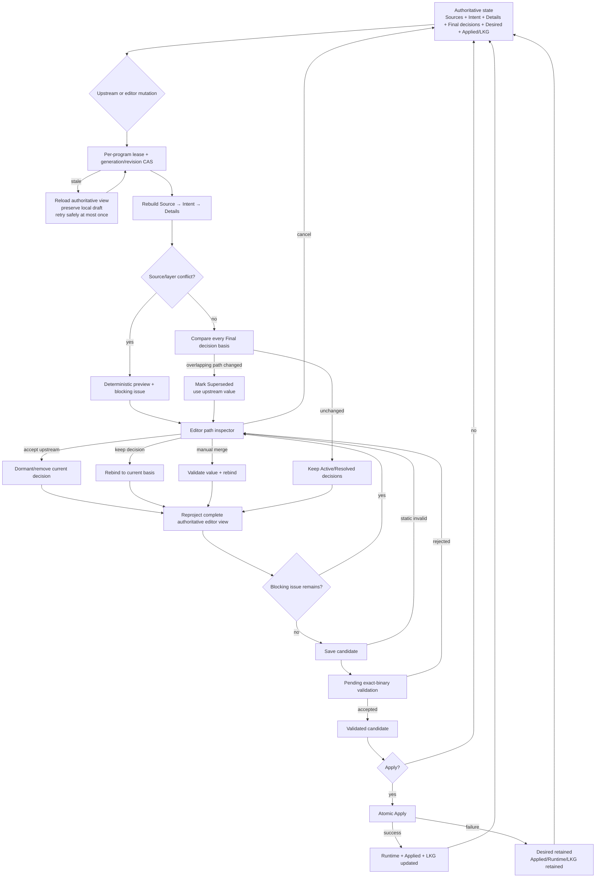

# Nexus 配置工作区架构与验收计划

## 目标与当前契约

配置页只提供一个 **Final configuration / 最终配置** 编辑器。它展示并编辑实际进入
Save、Validate 和 Apply 流程的 Desired candidate，不再并列显示独立 Raw 裁决面板、完整
Layer trace 表或第二份“最终候选”文档。

固定的数据流为：

```text
Sources → Base → Common Intent → Managed Details
        → Final editor decisions → Desired candidate
        → Static validation → Exact-binary validation
        → Apply → Runtime / Applied / Last Known Good
```

Source、Intent 和 Details 是上游生成层。编辑器自由文本修改会被 Core 解析为最小语义路径的
Final decision。Final decision 不是不可撤销的最高优先级覆盖：它绑定创建时的上游
generation、上游内容 hash 和路径值 hash；上游再次修改同一路径时必须重新裁决。

## 权威编辑器投影

`ConfigurationStateView.workspace.editor` 是前端唯一允许消费的最终编辑器投影。每个路径记录：

- semantic path 与可定位 segments；
- Source IDs，以及 Source、Intent、Details、Final decision 和 effective value；
- winner layer；
- Final decision 的 basis、origin 与状态；
- 属于该路径的结构化 issues 与门禁原因。

前端不得根据路径前缀、Rust 英文错误、旧 `desired.conflicts` 或另一份配置文档重新猜测归属。
没有本地草稿时编辑器内容必须等于 `workspace.editor.document.content` 和
`desired.content`；有本地草稿时只显示同一 session/revision 的 `workingContent`。

Final decision 状态语义：

- `Active`：basis 未变化，决定参与当前 Desired；
- `Resolved`：用户基于当前上游明确保留或合并，决定参与当前 Desired；
- `Superseded`：同一路径上游已变化，决定暂不参与，当前 candidate 使用上游值；
- `Dormant`：用户接受上游，旧决定仅保留为可审计/撤销历史。

父容器删除或替换必须覆盖其所有子路径和 identity-array 决定。不同 identity 的元素互不冲突；
未知字段和无关路径必须保留。只有 `Keep final decision` 或手工合并可以在新 basis 上重建已被
上游删除的父容器。

## 可重入状态机



## 保存、验证和应用

1. **Save candidate** 固化当前层级意图、Final decisions 和 Desired；它不修改 Runtime、Applied
   或 Last Known Good。存在 Source、ownership、draft-rebase 或 Superseded blocking issue 时禁止保存。
2. **Validate** 调用当前精确二进制的原生 validator。证据同时绑定 binary fingerprint、
   compatibility profile hash、candidate config hash 和 generation。拒绝或过期证据不能 Apply。
3. **Apply** 只接受无 blocking issue 且证据完全匹配的 candidate。写入或运行准备失败时保留旧
   Runtime、Applied 和 LKG，并返回可重试的结构化错误。

Compatibility 保存只更新目标偏好并重建 candidate。Unknown/custom build 可以没有 reference；
reference 只描述功能历史，不改变 binary provenance。Compatibility 页面提供 Validate current
candidate，验证通过后仍须回到 Final configuration 执行 Apply。

## UI、错误归属与可访问性

- 配置 tab 的显著标题、CodeEditor 和 Save/Validate/Apply 操作区各只有一份。
- 来源、diff、Superseded、validation 和 conflict 都附着在编辑器语义路径上；选择路径后才展开
  紧凑 inspector。正常来源标记属于信息状态，不计为 warning。
- Inspector 提供 Accept upstream、Keep final decision 和 Manual merge；取消不产生持久化变更。
- Intent、Details、Sources 与 Compatibility 只显示各自 surface/owner 的问题；Final configuration
  汇总完整候选链路。
- 错误包含稳定 code/message key、原因、影响、Applied/LKG 保留说明、恢复动作、Retry 和可折叠
  技术详情。技术详情不得记录完整 URI、密码、token、UUID、私钥或完整配置内容。
- 520、680、760、1024 和 1280px 均保持主操作可达且无横向溢出；状态同时使用文本、图标和颜色，
  支持键盘路径、焦点恢复、中英文即时切换及三主题/明暗模式。

## 不变量

- 所有配置 mutation 共用 per-program lease 与 generation/revision CAS。
- 上游变化只使重叠路径 Superseded，无关 Final decisions 不变。
- 上游关闭功能后，旧 Final decision 不得静默重新启用该功能。
- 重复 Save、Validate、刷新或裁决不得生成重复 operation 或无意义 generation 漂移。
- 取消裁决、取消 rebase 或丢弃确认不得改变 ProgramSpec、Desired、Applied、LKG 或 generation。
- blocking issue 未解决时不能 Save、Validate 或 Apply。
- stale generation、fingerprint、profile、config hash 或 validation evidence 必须 fail closed。
- storage、validation 和 apply 的任何失败都不得覆盖 Applied/LKG。
- 重启、刷新、切换栏目和语言后，编辑器、inspector、门禁与状态徽章来自同一权威 view。

## 验收记录

本轮自动门禁覆盖 Core、Desktop、Svelte、UI utility、native dependency contract、production build
和 Playwright。Windows 真实矩阵覆盖五个 sing-box 与五个 Xray 二进制，所有 Profile 保持 Stopped，
未执行 Start、TUN 或宿主网络变更。实际验证包括：

- 重复 exact-binary Validate 不产生 generation 漂移；
- 父容器删除使重叠子路径 Superseded，接受上游/保留决定后只恢复选定路径；
- Source 读取失败保留旧 snapshot，错误只显示在 Sources，恢复后重新变为 fresh；
- Unknown/no-reference 保存使旧 evidence 失效，页面内重新 Validate 后证据重新绑定；
- Apply（不 Start）仅在验证通过后更新 Desired/Applied/LKG，Runtime 继续 Stopped；
- 单一 Final configuration 编辑器中普通来源标记不再显示为 warning；
- 1280、1024、760、680、520px 均无横向溢出，紧凑 tab 和主操作保持可达。

交付前必须保持以下门禁通过：

```text
cargo fmt --all -- --check
cargo test -p camellia-nexus-core
cargo test -p camellia-nexus --no-default-features
cargo clippy --workspace --locked --all-targets --all-features -- -D warnings
pnpm --dir ui check
pnpm --dir ui test
pnpm --dir ui build
pnpm --dir ui test:e2e
git diff --check
i18n completeness
sensitive-information log scan
Windows WebView2 smoke and real binary matrix
```
