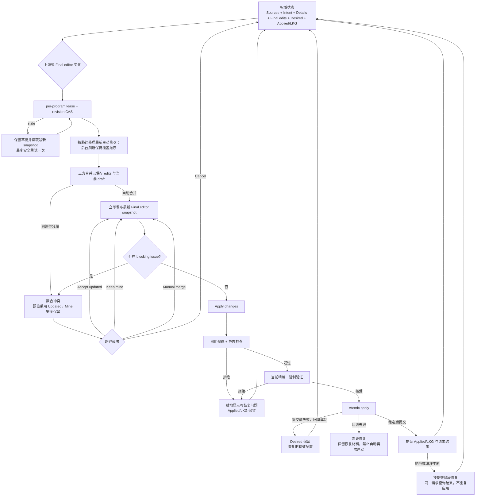

# Nexus 实时最终配置与单一应用验收计划

## 程序能力知识与准入

### 平台与语义检查

- 按稳定补丁绑定 Go AST 字段结构、相关函数与常量、依赖库提交、导入和构建条件。
- 平台约束仅检查当前配置启用的设置。缺失平台/构建信息保留为未确认，不能按客户端运行平台猜测。
- sing-box TUN 的自动重定向及自动路由依赖同时检查调用入口与 sing-tun 非 Linux 实现。
- Mihomo 同时检查自动重定向被关闭的平台分支、路由依赖和 TProxy 平台限制。
- Xray 区分 Linux、FreeBSD 和其他平台的套接字选项；零值、空值及未启用选项不制造多余警告。
- 候选与有效草稿的诊断进入编辑器快照，按具体路径标记；应用时仍重新核验身份、配置结构与原生结果。
- 结构覆盖、经审查的语义规则、当前二进制的原生接受分别记录，不互相冒充。
- 已保存的身份观察只校验有界结构；当前目录准入和应用权限独立校验。知识目录变化不阻止加载、查看、停止或更换程序。
- 管理器和控制器共用身份观察新鲜度判断；目录、探测实现或文件身份变化后重新识别，重建候选能力档案并失效检查依据，不修改 Applied/LKG。
- 编辑器优先显示可定位的平台或语义问题，不被先前笼统的原生拒绝遮住；问题修复后仍需对当前候选重新检查。

### 消息生命周期

- 成功反馈显示六秒；读取/刷新反馈与明确拒绝的操作显示十二秒，再次触发重置计时。
- 鼠标或键盘正在阅读错误提示时暂停自动关闭。
- 未确认写入、未保存草稿、无法加载的工作区和恢复问题保留原重试动作。
- 配置自身的阻塞问题由权威快照驱动，修正后消失，不用临时提示代替门禁。

配置链路以 [Core 能力知识与准入](docs/core-knowledge.md) 为基础。每个 Core 只维护以官方最新稳定
发布为锚点的两个稳定系列：sing-box/Mihomo 按主次版本分组，Xray 按实际稳定发布月份分组。
各补丁版本固定到精确源码提交；范围外、预发布和无法识别的程序不允许登记、应用、启动或重启。
范围内自编译程序仍需检查其实际构建能力；配置自定义字段须有明确结构或专门探测证据。

先完成源码知识、统一准入、配置语义规则与 UI 接口整合，再集中运行配置闭环回归和 Windows 授权
构建。客户端离线使用已审查的稳定发布目录，版本基线由自动识别产生。

实施顺序：源码结构提取与覆盖报告 → 稳定窗口及准入 → 规则与构建能力 → 各配置消费者和事务 →
单一检查状态 UI → Rust/前端集中回归 → 停止状态真实客户端验收 → 更新 PR #29 原分支。

能力知识验收记录：

- 目录已固定 24 个 sing-box、43 个 Mihomo、2 个 Xray 稳定发布的源码提交，并生成独立结构覆盖和补丁差异报告。
- AST 提取覆盖嵌入类型、JSON/YAML/proxy 标签、Schema 注解、自定义解码器、显式与文件名构建条件和 CGO 导入条件；函数行为摘要不受注释和排版影响。
- 稳定窗口、标签提交、提取器和报告摘要已有离线及只读上游核对；审查规则所绑定的函数行为变化时停止生成，要求重新审查。
- 程序探测与校验结果绑定构建时生成的 Core 实现摘要；文件未变但探测实现变化时重新识别。
- sing-box 结构读取只依据当前探测结果，不从固定发布阈值推断；原生返回的结构继续受体积、方言及本地引用限制。
- 已用真实协调器验证源码规则拒绝、现用配置保留、草稿保留与修改后直接应用；原生测试桩返回成功不能绕过已确认规则。
- 已提取 sing-box 入站/出站注册调用链、Mihomo 代理解码及 Xray 协议加载器；分开记录构造器、条件分支、拒绝分支及补丁间变化，不把类型注册本身当成实际功能证明。
- 已用真实协调器验证运行中的程序遭遇不合格二进制替换时，重启被拒绝且不会停止原进程，停止入口仍可用。
- 语义规则覆盖仍需补齐。结构覆盖数不代表完整能力支持；其余注册表、依赖配置类型、自定义字段证据以及自动识别界面均列为后续必需验收项。
- 解析注册表、维护工具及目录一致性随集中回归验证；当前验收状态见文末。

## 用户模型

程序详情中的配置工作区遵循路径级最新操作：

```text
Sources / Common Intent / Managed Details → Latest path writes → Upstream
                                                ↓
                                      Final editor changes
                                                ↓
                                      Effective candidate
                                                ↓
                                           Apply changes
                                                ↓
                         Save → Static checks → Exact binary validation → Atomic apply
                                                ↓
                              Runtime / Applied / Last Known Good
```

`Final configuration / 最终配置` 是唯一候选工作区。它始终显示 Sources、Intent、Details 和
Compatibility 的最新结果，并叠加用户在最终编辑器中的手工修改。用户只需处理真正的同路径冲突，然后
点击一次 `Apply changes`；程序运行时按钮显示 `Apply and restart`，且只确认一次。保存、静态检查、
精确二进制验证和原子应用在同一受控操作中完成。

界面不把实现阶段拆成连续按钮，也不向普通用户展示证据摘要、文件指纹、内部 generation 或重复的下一步卡片。
Compatibility 默认用紧凑的程序识别与状态摘要；展开后仅解释支持版本和配置检查结果。错误默认是一句可执行的结论，
内部代码只供支持人员按需查看。英文长词、中英文切换、主题与中间窗口宽度都不能造成标签或控件越界。

最终编辑器内容取自权威工作区快照；在同一程序中切换详情栏目时复用该快照，手动设置成功后立即采纳返回的完整快照。
可选的配置说明和编辑器 Schema 在候选出现后异步加载，不能阻塞编辑。打开工作区时先展示磁盘上的候选预览，
随后核对当前二进制；核对期间与失败后均禁止应用，但不让完整文件指纹计算阻塞编辑器。核对阶段复用已读取的配置状态，
避免同一请求重复读取与重建投影。候选已保存而原生校验拒绝是独立状态：保留候选及旧 Applied/LKG，用户修正后可原位重试。
调试与临时授权构建对 SHA-256 实现启用优化，完整文件身份检查仍在应用边界执行；不通过缓存时间戳
替代内容校验。原生检查无法启用自动流量重定向时，提示检查 TUN 的 `auto_redirect`，不笼统归为保存失败。

本轮验收：慢工作区读取与慢编辑器说明模拟下，最新设置仍能立即进入最终编辑器；可选说明读取失败后，
编辑器保持可用且配置建议可原位重试。完整浏览器回归 154 项覆盖中英文、三主题和中间宽度的
栏目标签/图标边界。Core 163 项、桌面 199 项与无默认特性 98 项测试、全特性 Clippy、前端检查/单测/构建及
依赖审计通过；依赖审计仍保留仓库既有的非阻断维护性告警。

平台能力与反馈回归：Core 167 项、桌面 201 项、无默认特性 98 项以及完整浏览器 156 项通过；
Go AST 提取器、维护工具 22 项测试、目录离线一致性、Clippy、前端检查/单测/构建和发布安全扫描通过。
逐补丁检查 sing-box 的 TUN 自动重定向、路由依赖与网络命名空间，Mihomo 的自动重定向、路由依赖与
透明代理端口，以及 Xray 的 socket mark、拥塞控制、用户超时、最大分段和窗口限制。
平台未知、关闭的选项、未启用的 TUN、FreeBSD 与 Linux 差异均有回归覆盖。
这些是已审查的语义规则，不代表所有源码字段已具有完整运行行为证明。Windows 实际客户端验收单独记录。

Windows 平台验收：普通构建与隔离授权构建均由内置脚本完成，客户端实际授权为 active。
官方 sing-box 1.14.1、Xray 26.3.27、Mihomo 1.19.31 分别注入自动重定向或 socket mark，编辑器立即
显示平台限制、定位到字段并阻止应用；修复后提示消失，应用成功且保持停止，失败候选未改变 Applied/LKG。
来源保存反馈过期后，未修复的平台问题仍保留。SingBoxTest 的 timestamp 往返、行内保留/接受、手工合并、
取消与单一应用均通过。23,269 字符的保留候选三次打开编辑器为 189/69/68ms。
真实 WebView2 的中英文、三主题、明暗媒体与 400–1280px 共 120 个布局检查通过，包含平台提示子元素
与栏目标签边界。尺寸和明暗通过 CDP 设置，不能替代 Windows 显示缩放的实际验收；125%/150% 尚未核验。
测试全程未启动受管程序，未改变宿主机网络；授权材料、配置备份与脱敏截图留在本地测试目录，不纳入提交。

## 实时三方合并

Sources、Intent、Details 不拥有固定的相互覆盖优先级。用户主动修改的语义路径以最后一次操作为准，
使用程序内单调事务顺序而不是系统时间排序。后台 Source 刷新更新 Source 贡献但不提高其覆盖顺序；
尚未被用户接管的路径以及新增路径正常更新。保存表单只提交实际修改的字段，不重放未改字段。
恢复跟随撤销本栏目贡献；明确删除则作为新的路径操作。再次使用已被其他栏目改写的值是明确的局部操作。
Details 在受影响字段旁显示当前最新值和“使用此值”。该动作只重新采用选中的已保存字段；不会重放整项
集成，也不会覆盖已有的其他端口、扩展字段或来源自定义值。必要的缺失结构由注册表补齐。

连续上游更新必须保留每个未解决冲突的基线、用户值和最新上游值；冲突预览不是新的用户原值。
格式无效的草稿安全保留，上游更新后默认展示最新候选，恢复未完成编辑时明确标注草稿模式。

每次 Sources、Intent 或 Details 成功变化后，后端立即重建 Upstream，并以用户开始编辑时的 Upstream
为基线执行语义三方合并：

```text
Base    = 开始编辑时的 Upstream
Mine    = 用户的 Final editor 结果
Updated = 当前最新 Upstream
```

合并规则：

- `Mine == Base`：直接采用 Updated；
- `Updated == Base`：保留 Mine，并绑定到当前 Upstream；
- `Mine == Updated`：自然收敛并删除冗余编辑；
- 对象的不同字段和 identity array 的不同元素递归自动合并；
- 同一标量被双方改成不同值时，生成一个路径冲突，预览显示 Updated 并安全保留 Mine；
- 父容器删除或替换与其后代变化聚合为一个父路径冲突；
- 无稳定 identity 的有序数组发生双方不同修改时生成一个序列冲突；
- JSON/YAML 格式、键顺序、等价数字和规范化后的程序语义值不构成变化；
- 无关路径永远不会因为另一处变化而要求用户裁决。

相同 Source 内容再次保存是幂等读取，不构成新的路径写入，也不能隐式撤销最终编辑器中的手动删除。
当 Source 已保存而最终候选不同，Sources 显示简短说明并引导至最终编辑；选中普通手动改动后可
`Use latest setting / 使用最新设置`，只撤销该语义路径上的最终编辑。此操作以编辑标识、路径、
状态及草稿 revision 校验并原子提交；未完成草稿保留且阻止该动作，过期选择需要重看当前值。
操作回执支持重复请求，故响应丢失不会造成第二次改动。Applied 与 LKG 不随这一候选编辑改变。

冲突检查器只提供四个直观动作：

- `Accept updated`：该路径采用最新 Upstream；
- `Keep mine`：该路径保留用户值并重新绑定当前 Upstream；
- `Merge manually`：校验合并值后重新绑定；
- `Cancel`：不写入任何状态。

冲突恢复直接对应问题来源：最终编辑的重叠路径在编辑器内逐项选择；配置源同级冲突在 Sources
按来源合并提示，标出所有相关来源并允许分别定位，用户可暂停或修改其中一方后保存；无效或不可用来源可原地
重试并定位检查；已保存的 Intent、Details 值可针对单个字段再次采用。静态配置错误允许在
最终编辑器直接修复并点击应用，系统重新计算候选而不要求先处理已被新文本修复的旧提示。
原生检查拒绝保留候选并允许修复后再次应用。明确拒绝的冲突选择不会锁住其他选择；提交结果
尚未确定时保留原请求供重试，不能生成第二次选择。

普通编辑、草稿保存、冲突裁决和来源刷新只使用已登记的程序身份生成编辑器快照，避免每次输入
或设置更改都重新读取整个可执行文件并探测版本。应用前仍重新核对精确二进制、能力档案与
候选；文件缺失或被替换时可保留未完成文本，但不能通过应用检查。编辑器仅在存在路径标记时
建立路径索引；连续输入期间延后重定位标记，避免每次按键解析整份长配置。

## 权威状态与事务

配置状态由内容和职责命名，不使用发布序号描述契约：

- `stateRevision`：所有持久化写事务的 CAS；
- `candidateGeneration`（序列化字段 `generation`）：候选内容或 Compatibility profile 实质变化时递增；
- `draftRevision`：Final editor session 的 CAS；
- `FinalEditState`：Upstream basis、稀疏语义编辑、聚合冲突和已保存候选标记；
- `ConfigurationEditorView`：最终文档、Clean/Modified/Conflict、稀疏变化、冲突、门禁和候选状态；
- `ConfigurationWorkspaceSnapshot`：权威配置状态、对应 editor session 和请求结果。

配置状态与 editor session 保存在同一原子文件中。Source 回滚、保存候选和草稿删除都以这份文件为
提交单元，不能先改候选再单独写草稿。重复读取不执行草稿写入。

保存与应用请求携带 `operationId`、操作类型、`expectedStateRevision` 及 editor session/draft revision。后端在程序
lease 中检查请求；结果与 Applied/LKG 一起持久化。同一请求的重发只返回原结果和当前权威工作区，
不能再次应用随后产生的新候选。请求编号被用于不同参数时拒绝；中断的请求需要重新检查配置。
保存候选、消耗对应草稿与 Saved 回执在同一文件替换中提交，存储失败三者均不改变。
保存响应丢失时重试先查询原请求，返回当前权威工作区但不保存或删除后来产生的编辑。
同一请求重复查询不推进 revision；新的成功请求记录其回执，候选内容未变时 generation 不变。

Common Intent 的标量和对象操作统一通过 `update_configuration_intent` 提交。注册表根据精确能力档案解析字段、选项与平台条件；客户端不能指定任意配置路径。请求绑定 operationId、state revision、editor session 与 draft revision，成功返回完整工作区快照。同一请求复用回执；候选值未变化不推进 candidate generation。

结构化设置由 Listener、DNS、TUN 与轻量规则适配器生成原生配置。带 tag 的对象按身份修改；Mihomo DNS 与简单规则使用原值绑定的稀疏列表编辑，不保存整份来源列表。编辑保留原位顺序与兄弟条目，重复条目不能猜测选择。LAN 创建或切换要求认证；凭据不进入对象投影或日志。引用不存在、循环 DNS 引用、删除仍被使用的目标及兜底规则遮蔽均以可恢复错误阻止提交。无法安全表达的对象转到最终配置编辑。

意图页使用等宽纵向分组，不使用高度不一致的并排卡片。组标题包含图标与主题色标识，可折叠且不写配置；宽容器的标量设置最多两列，窄容器将名称与控件纵向排列。普通开关有明确的开／关文字；字段操作与高级选项按需展开。入口、DNS、规则和虚拟网卡拥有独立的添加入口与摘要列表，大型列表使用精确条目选择器。结构化表单有明确的编辑标题、访问保护区与完成／取消操作；未提交输入在组折叠时保留，取消后恢复焦点，提交中不清空页面。应用按钮仅在页面标题区显示一次；对象表单尚未完成时禁用应用，并在标题说明中提示完成或取消，避免应用不含当前输入的候选。缺少引用目标时显示下一步，不留下无解释的空选择框。描述符按能力档案缓存，快照投影共享对象与引用索引，不在打开页面时新增网络请求或二进制探测。

意图交互验收：完整浏览器回归 176 项通过，包含三个程序的入口与 DNS 添加／修改／移除、路由目标引用、兜底规则恢复入口、折叠保留输入、完成／取消焦点恢复和未完成条目的应用门禁。中英文、三主题明暗组合、400–1280px 的控件相对分组边界及 Axe 检查通过。Core 184 项、桌面 202 项、无默认特性 98 项及全特性 Clippy、前端检查／单测／构建、知识库 23 项测试、离线目录一致性、格式和发布安全检查通过。依赖字段使用完整有效输入进行能力探测；局域网访问及认证控件覆盖全部收录稳定补丁，实际提交仍要求完整认证。Windows 原生客户端验收与浏览器预览分开记录。

意图表单的流程为 `查看 → 编辑 → 提交 → 权威快照回投`；提交失败保留输入，取消不发送请求。一次编辑一个对象，折叠所属组时显示“编辑中”以便返回；DNS 域名与 IP 地址使用对应的输入引导，系统解析不要求服务器地址。日志、解析偏好、路由模式与对象摘要的选项在中英文切换时立即更新，而原生值与对象引用保持不变。兜底规则遮蔽、重复条目等需要完整编辑器处理的问题提供最终配置入口，不重复提交无效请求。返回意图页时定位到标题与唯一应用操作，避免沿用编辑器滚动位置隐藏主要控件。

Common Intent 只写入注册表声明的字段。Managed Details 只写入托管集成注册表
声明的字段。Sources、Intent、Details、Compatibility、Final draft、冲突裁决和 Apply 全部进入同一
per-program lease；成功操作原子返回完整 snapshot，前端不得拼接局部状态。

上游操作开始前，客户端先串行落盘当前编辑文本，再使用最新 revision 提交操作。返回 snapshot 后必须
完全采纳后端的三方合并结果。被动读取只有在没有发生权威变化时才允许保留键入中的文本。stale CAS
最多安全重试一次；无法确认安全时保留草稿并要求重新读取。

无效 JSON/YAML 可以作为草稿安全保留。若此时 Upstream 更新，界面默认展示最新权威候选，并提供
`Resume edit` 与 `Discard`；修复语法后再执行三方重基，不能静默覆盖或丢弃文本。

## 程序包更换事务

托管目录更换在同一配置 lease 中执行，复制和探测在授权提交门之外完成：

```text
准备新目录并准入 → 核对 stateRevision → 根据新能力档案重建候选
→ 最终授权复核 → 核对 ProgramSpec 与暂存二进制指纹
→ 保存原设置/工作区副本及 Prepared 标记
→ 替换设置、候选/草稿和程序目录 → Committed 标记 → 清理提交材料
```

Prepared 中断恢复原设置、工作区和程序目录，保留副本直至 Restored 标记持久化。
Committed/Restored 的清理可重复进入；清理未完成不能移除阶段标记。标记创建前仅有准备副本，不修改
有效文件。无法完成恢复时阻止二进制检查和启动，保留材料并显示一次恢复提示，不声称状态未变。

程序包提交保留 Applied/LKG，候选绑定新的能力档案且需重新检查。返回完整 snapshot，前端同步最终
编辑器和草稿，同时保留其他字段尚未保存的表单输入。包更换不调用 Apply，也不启动程序。

## 单一应用状态机



程序运行时，用户确认一次后由 Controller 在同一应用事务中完成停止、写入、启动和失败回滚。客户端不
手工拼接 stop/start，也不因 Details 托管字段或 Source 内容变化触发无关重启。

Apply marker 的 `Prepared` 和 `Committed` 阶段由 Controller 的稳定结果决定；配置文件内容碰巧
相同不能证明提交成功。只有提交前失败且回滚成功时才能提示旧状态已恢复；提交后的响应丢失必须先
确认结果，回滚本身失败时明确显示需要恢复。恢复核对实际提交字节，不把重新格式化后的哈希与原始字节
哈希混合比较。

## 配置 Tab UI 合同

配置 Tab 只保留：

1. `Final configuration` 标题；
2. 一个主状态：Clean、Modified、Conflict、Ready to apply 或 Applied；
3. 仅在真实问题存在时显示的紧凑摘要；
4. 唯一最终候选 CodeEditor；
5. 编辑器内仅展开一处冲突对比块；普通改动选中后才显示简短路径详情；
6. `More`、`Revert` 和唯一主按钮 `Apply changes / Apply and restart`。

普通 Upstream 字段不显示徽章。用户编辑使用低干扰 gutter 标记；merge conflict 使用琥珀色 marker；
静态或 native 错误使用红色 marker。顶部冲突摘要仅显示数量与前后导航。选中的冲突在编辑器内并排
显示“更新后的配置”和“我的修改”，窄屏改为上下排列；接受更新、保留修改和手工合并均在这一处完成。
空手工输入不代表删除，删除字段使用明确按钮。正常删除定位到父节点锚点，不报告路径定位故障。
路径索引在同一文档投影中复用；只有当前展开的冲突生成值对比。技术 basis、hash、source id 和
native output 默认折叠。错误结构固定为简短结论、影响、一个恢复动作以及可折叠技术详情。

草稿和已保存编辑的冲突投影均携带内部归属、稳定冲突标识、内容指纹与预期 revision。行内按钮、导航
和键盘使用同一个 `resolve_configuration_conflict` 入口。事务在程序配置 lease 中核对冲突与 CAS，
原子保存候选、草稿和操作回执，再回投完整快照。相同请求重试返回已提交结果；同一个操作标识携带
不同内容时拒绝。撤销与重做仅处理所选语义路径，最新上游改变时要求重新查看值。请求错误只显示在
对应对比块，成功回投立即清除；其他校验错误保持独立。

Compatibility 自动展示当前程序和已识别的稳定版本，不接受参考基线输入。默认只显示一个简洁结论和一个主操作：

```text
识别读取失败              → Retry detection
程序不符合维护范围         → Replace program
Final 有未应用内容或问题    → Open Final configuration
候选已应用                 → Review Final configuration
```

支持范围、知识库摘要、源码依据、fingerprint、profile/config hash 和不含配置值的检查报告进入
`Advanced details`。程序文件不符合准入规则时，工作区仍可查看和保留未完成编辑，但不展示缓存身份为当前
已识别结果，也不复用旧验证通过提示。再次读取成功后从权威快照清除准入阻塞。

## 响应式与提示规范

- 所有 flex/grid 子项使用 `min-width: 0`；
- 卡片、工具栏和按钮组允许自然换行；400–520px 主操作占满一行；
- 英文复合词、路径和 hash 使用 `overflow-wrap: anywhere`；
- CodeMirror 只允许自身滚动，不得撑破父卡片；
- dialog、popover、tooltip 限制在 viewport 内；
- 中文、英文、长英文测试文本在 400、520、680、760、1024、1280px 及 Windows 100%、125%、150%
  缩放下不得溢出、重叠或形成不可达操作；
- 成功且无需处理的消息使用短暂 aria-live 反馈；需要处理的问题只留在拥有它的栏目；
- Intent、Details、Sources、Compatibility、Configuration 和 Logs 不互相泄漏专属错误；
- Rust 原始错误只进入技术详情，显著文案使用稳定 message key 本地化。

## 安全与可重入不变量

- Final editor 无草稿时等于权威 Desired；有有效草稿时等于对应 `workingContent`；
- Sources、Intent、Details 成功后，Final editor 在同一 snapshot 中立即更新；
- 上游变化只影响实际重叠路径；用户未编辑路径始终跟随最新 Upstream；
- blocking Source、ownership、merge 或 draft conflict 未解决时不能进入应用事务；
- Compatibility 内容变化只使验证证据失效，配置内容未变时不制造额外保存步骤；
- 验证证据必须同时匹配 binary fingerprint、profile hash、config hash 和 candidate generation；
- 相同 Source、相同 Intent/Details、重复读取、重复保存和重复验证不漂移 candidate generation；
- Cancel、解析失败、静态检查失败和 native 拒绝不修改 Applied/LKG；
- 提交前的存储或应用失败恢复旧有效状态；恢复失败保留材料并明确阻止继续应用；
- 未提交时保留 Desired 和草稿；已提交但响应丢失时查询原请求结果，不重复执行；
- Source/Intent/Details/Compatibility 事务失败完整回滚 ProgramSpec、配置状态和 editor session；
- 日志只记录 program/source id、generation、hash、路径和结果，不记录完整 URI、密码、token、UUID、
  私钥或配置正文；
- 真实测试不点击 Start、不启用 TUN、不修改宿主机网络、路由或网卡。

## 集中验收顺序

先完成代码、UI 和自动化修复，再执行一次 Windows 临时授权构建：

```text
cargo fmt --all -- --check
cargo test -p camellia-nexus-core
cargo test -p camellia-nexus --no-default-features
cargo clippy --workspace --locked --all-targets --all-features -- -D warnings
pnpm --dir ui check
pnpm --dir ui test
pnpm --dir ui build
pnpm --dir ui test:e2e
git diff --check
i18n completeness
sensitive-information log scan
```

临时授权 standalone 输出到新的时间戳目录，不覆盖现有客户端。使用测试目录中的程序资源完成一次集中
验证：

- Sources 长内容、新增/启停/排序、malformed 与 wrong type；
- Intent、Details、Source 的无关路径自动合并和同路径冲突；
- Accept updated、Keep mine、Manual merge、Cancel；
- 新增、删除、父容器替换、identity array、重复 identity、非法端口和错误类型；
- 无效草稿、刷新、切换 Tab、重启、重复操作和 stale revision；
- Compatibility 自动识别、单一恢复操作和高级详情；
- 停止状态下 Apply、native rejection 与 Applied/LKG 保留；
- 中英文、多宽度、多缩放、键盘、焦点恢复、ARIA、明暗主题和长无空格文本。

完成真实验证后保留最新临时客户端和必要证据，核对 PR #29 的 head，以普通追加提交更新原分支；不覆盖
他人的新增提交，也不合并 PR。

## 验收进度

- 已覆盖程序二进制被替换成不支持版本后的工作区查看、草稿保留、旧校验拒绝和恢复识别。
- 已覆盖合格二进制更换遇到工作区写入失败时的完整回滚、原地重试，以及 Applied/LKG 保留。
- Compatibility 的前后端手选参考入口与可持久化设置已删除；识别失败反馈仅归属 Compatibility。

- 已覆盖真实 coordinator/storage 的最新写入、连续冲突、无效草稿、并发删除和原子工作区回滚。
- 已覆盖应用提交前失败、提交后恢复、同一请求重发、工作区重新加载，以及 candidate generation
  不变但 draft/state revision 变化时拒绝旧应用请求。
- 前端已覆盖一键应用响应丢失后查询原结果，断言没有第二次应用。
- 已覆盖查询应用结果时保留后续输入，以及 Details 最新值展示、单字段重新采用和 400px 控件边界。
- 已覆盖 Details/程序文件更换失败后的完整回滚与原地重试；回滚文件恢复后仍保留备份，支持重复恢复。
- 来源凭据与工作区共用提交边界。密码更新使用独立绑定，崩溃恢复不能将仅修改密码误判成相同提交；
  未确认工作区提交阶段前不会清理凭据恢复材料。
- 语义未变时保持候选原文和 generation；只改变兼容目标时保留保存标记，重新验证当前目标。
- 程序身份和分享协议源码判定已接入双系列知识库，功能事件目录已删除。源码声明保留逐发布解析入口和构建条件，
  不宣称安装文件具备能力。
- 已接入当前配置使用的解析入口构建条件：拒绝构造器、缺少标签和未确认信息分别判定，不将原生成功作为绕过条件。
- Mihomo 报告标签逐补丁绑定实际版本输出和开关源码分支；仅对已证明完整报告的标签使用缺失判断，避免误阻止正常构建。
- 已覆盖真实后端构建能力拒绝：原生检查尚未调用，草稿与 Applied/LKG 保留；改为可用配置后原地应用成功，程序仍停止。
- 字段与原生检查错误具备中英文文案；诊断不回显配置值。其他配置诊断入口的边界审查仍需完成。
- 已接入各维护补丁的顶层字段证据：AST 根声明、底层类型、嵌入字段与原生编码标签共同确定入口。
  未声明入口只接受当前二进制明确声明的扩展结构，不将开放映射、条件分支或原生成功视为字段支持。
- 已覆盖未声明入口拒绝后的草稿/Applied/LKG 保留、原地修复、明确结构接受及二进制变化撤销旧证据。
- 结构读取限制外部引用、资源重新定基、输出大小、深度和遍历预算；示例中的字面引用不作为结构解析。
- 诊断提供权威文档路径；编辑器按对象键和数组下标定位并即时本地化，不通过重复字段名猜测行号。
- 类型知识保留模块身份、指针、序列、映射、泛型与导入引用；覆盖报告明确列出未解析引用。
  后端沿已知结构检查嵌套字段，并以解析注册表选择 Xray 独立协议选项，证据始终绑定完整文档路径。
- Xray 协议名规范化从精确源码加载器提取；JSON 字段大小写变体不能绕过构建、语义或嵌套字段检查。
  实际文档路径保留原始键名，YAML 不套用 JSON 的大小写规则。
- 真实协调器与文件存储覆盖连续嵌套错误、定位、草稿/Applied/LKG 保留及原地修复后单次应用。
- Mihomo 平铺代理已接入逐补丁的协议选项、嵌入公共字段与独立 `smux` 声明；分别保留入口和嵌套反射
  解码规则，不把同一种字段展开方式套到所有补丁。内部字段和剩余映射不视为已声明用户选项。
- 缺失、格式错误和未登记的协议类型不能跳过字段检查。真实协调器覆盖连续失败、重新加载、草稿及
  Applied/LKG 保留、修复后应用，以及同一应用请求重发时不重复调用原生检查；全程保持停止状态。
- 待完成：配置结构全面接入依赖库定义，补齐嵌套解码注册表与自定义字段的实际能力证据规则。
  - 已接入 sing-box 各稳定补丁实际引用的 JSON 依赖源码：核对模块校验和、官方 Git 标签/完整提交，分别记录模块身份与声明命名空间，补丁报告包含依赖变化。
  - 来源引用由所属模块解析提交，不把依赖文件归到程序提交；提取函数体不等于确认解码语义。
  - 已收录包的导入名称从模块身份及 Go 包声明解析，不从目录名称推断；类型、函数转接入口、解析注册表和构建标签报告共用该解析器。测试覆盖包名与路径不同、显式别名、同目录生成工具和不明确的包身份。
  - sing-box 入站与出站注册表已接入公共声明和 `UnmarshallExcludedContext` 的排除/选项合并关系；函数体、导入、映射删除和字段选择共同构成审查证据。
  - 公共键排除采用精确键名，协议选项随后进入 JSON 解码；公共键与协议键的独立匹配、排除优先权及普通嵌套对象回归覆盖窗口内所有 sing-box 补丁。
  - 解码器的构建条件与协议构造器独立判定。无法确认的解码分支、未登记类型和未声明字段在原生检查前阻塞；真实协调器覆盖连续失败、重载、草稿与 Applied/LKG 保留、修复后应用和相同请求重发。
  - 提取器已记录函数转接入口、导入身份和构建条件，并报告导入重绑定；部分依赖存在 `without_contextjson` 分支，不能混用两种解码行为。
  - 自定义对象（包括支持标量简写的选项）与普通结构分开处理，需按各自入口核对，不能从底层字段表推断完整解码行为。
  - UDP-over-TCP 自定义入口已按各补丁绑定布尔/null 简写、严格对象解析、JSON 键匹配、底层依赖和构建分支；未知对象字段不再跳过检查，明确的当前二进制扩展结构仍可提供独立证据。
  - 编译器 release 条件使用程序构建输出中的明确 Go 版本数字，不从任意文字或用户标签猜测；缺失、预发布或附注形式保留为未确认。回归覆盖逐补丁正常形式、未知字段、错误形状、缺少编译器信息及修复后重新应用。
  - 自定义解码、依赖类型、动态映射与普通结构分别建立证据，不以单个选项结构代替整个解析入口。
- 候选校验、配置操作失败和 Xray API 拒绝共用固定分类与退出/输出大小报告，不回传原生错误原文。
  JSON/YAML 语法错误保留位置，避免回显字段值或重复映射键。类别识别不参与能力判定或事务决策。
- Xray 详情查询复用 Core 的 JSONC 解析入口，移除独立解析及原始错误拼接；覆盖语法错误的位置报告、非对象根拒绝和修复后再次读取。
- 真实协调器与文件存储已覆盖双输出流包含合成敏感值时的拒绝、重新加载与修复后再次应用；
  草稿、Applied/LKG 保留，IPC 与持久化诊断不含测试敏感值。
- 最终编辑器集中显示一次简短错误，技术报告默认收起；无可信位置时不将整份文档标红。
  保存与格式化提示自动消失，移除独立的 Xray 解析输出入口。
- 身份报告不再保留任意版本横幅和附注，只保留版本数字及独立的预发布、构建元数据标记；
  三个程序的稳定、自编译附注、预发布和无法识别输入均覆盖，准入判断不因信息收敛而放宽。
- 已复现并修复 Unix 检查取消后子进程存活的问题，覆盖取消后的再次检查、输出读取任务回收，
  以及正常退出、超时、输出超限时子进程管道的关闭。Windows Job Object 的真实取消回归仍待原生验收。
- 待完成：其他配置诊断入口的敏感信息边界审查。
- 后台来源刷新失败只记录程序标识和错误类别；日志捕获测试注入包含凭据的地址、参数和配置值，确保原始错误及技术详情不进入日志。
- 来源读取、下载和解析失败以固定类别返回；来源状态只持久化可本地化的原因键，不保留路径、响应正文或解析原文。文件修复后可原地重试，旧 Applied/LKG 在失败期间保持不变。Sources 页只保留对应来源的一条原因与重试入口，避免同一故障重复堆叠。
- 已覆盖程序包更换的共同提交、失败回滚、准备中断、提交/恢复后的重复清理、草稿保留、过期 revision 和暂存二进制篡改。
- Intent、草稿更新/重基/丢弃、冲突处理和保存/应用入口统一先取得配置 lease，再取得授权保护，避免授权切换与排队配置互相等待。
- 手动、定时和来源列表刷新共用准备/提交流程；下载不占用授权保护、不提前写入候选或分享内容 sidecar。
  提交重新核对 ProgramSpec 与 stateRevision，最终授权失败或过期结果不能覆盖准备期间的新草稿、Intent 或程序设置。
  返回完整权威 snapshot；来源列表失败沿共同工作区边界回滚。
- 真实协调器/存储新增覆盖准备后出现三类新编辑、授权拒绝后放弃、存储失败后重试，以及来源提交、排队编辑与授权切换并发。
- 保存候选的身份识别、原生校验与应用暂存不占用授权保护；每个持久化提交重新核对授权，应用提交同时核对 ProgramSpec 与 stateRevision。
- 保存请求覆盖过期 state/draft 拒绝、存储故障原子保留、重启后回执查询、跨操作误用拒绝；前端覆盖响应丢失后继续编辑再重试，不重复保存或丢失新输入。
- 自动保存按程序排队，连续输入等待前次响应时只推进草稿 revision，不替换原始编辑基线；成功结果取消已覆盖的待执行定时任务。
  延迟失败只反馈给对应程序、会话和仍相同的文本，不串入新选程序；保留文本并提供有效重试，新编辑成功后清除过期错误，不自动循环重试存储失败。
- 验证结束和应用提交前核对二进制及暂存内容；运行中应用在停止旧进程之前拒绝已变化的输入。
  授权拒绝、竞争草稿/程序修改和文件变化保留当前候选与 Applied/LKG，清理被拒绝的暂存文件，允许修复后重新应用。
- 分享来源零接受结果使用稳定错误代码；目标重新识别不再按英文诊断文本决定来源处理分支。
- 待完成：所有写入口的统一请求上下文、安全重试及其授权边界复核。
- 显式保存/应用回执记录本次实际保存的候选 revision，原生拒绝仍保留此绑定；前端保留等待响应期间的新输入，暂缓争用的自动保存，依据已确认提交推进编辑基线，不把自身提交误判为上游冲突。
- 未完成 JSON/YAML 的重基按实际语义差异判断：格式和受支持的时长等价写法不隐藏正在输入的文本；真实上游变化保留原基线，修复后再合并。保存、应用成功和原生拒绝均覆盖继续输入与重新加载流程。
- 编辑器语法结果与当前文本和语言绑定，过期结果不控制应用按钮；无效文本就地显示简短修复提示，修复后恢复操作，不增加确认。
  响应丢失后的回执恢复区分继续输入与无新输入：前者保留新草稿，后者采纳已保存/已应用结果，不误显示新的未应用修改。
- 程序详情与配置编辑共用工作区事务；应用只面向当前 ProgramSpec，不提供同时替换程序设置的应用接口。
  相同候选的重复应用同样核对当前 stateRevision 与 ProgramSpec；等待授权期间的新草稿或设置变化必须拒绝过期结果。
  快速返回同时核对当前二进制、有效文件与持久化校验依据，不执行额外程序；拒绝保留 Applied/LKG，修复后可重试。
- 程序包更换后保留有效/无效草稿和 Details 未保存输入的 2 条定向 UI 流程通过，覆盖修复后继续应用、栏目切换及 400px 边界。
- Rust 故障测试另外确认提交点会拒绝已过期的工作区状态，不覆盖准备期间出现的新编辑。
- Windows 隔离授权客户端已用官方 sing-box、Xray、Mihomo 稳定二进制验证停止状态的实时来源回投、单次应用、原生拒绝与 Applied/LKG 保留。
  sing-box 维护窗口内旧系列稳定版可准入；官方预发布版和窗口外 Xray 旧版被拒绝，失败不留下程序目录。官方包摘要、客户端截图和脱敏结果留在本地测试目录，不纳入 PR。
- 真实窄屏检查发现的导航遮挡、半透明抽屉透字、跨程序编辑器路径残留、诊断状态误报及长表单拒绝提示不可见问题已集中修正。修正后的隔离 Windows 客户端 SHA-256 为 `e63e77197caeb605f4c8c98ae0d84b0102298f4ef07726b1c615bd78fc129418`；客户端再次确认 Licensed / Pro，680px 配置页只显示一个 Needs attention 状态与一条原生拒绝原因，表单拒绝后滚动至可见提示。测试程序仍全部停止。
- 本地增量回归：Core 159 项、桌面 197 项、无默认特性 98 项；最新修改后的完整 UI 150 项通过；全特性 Clippy、格式、前端检查/单测/构建和差异检查通过。
  冲突恢复路径覆盖确定拒绝、响应丢失、来源暂停或编辑；多来源同一路径、身份元素替换及父子路径冲突的提示与最终预览一致，父子冲突合并为一处。来源冲突以结构化路径保存，不因普通字段名与身份路径的显示形式相似而漏报。编辑器与 Core 对 JSON 注释、末尾逗号的语法判断一致。普通编辑、草稿和来源更新不重复探测二进制身份；应用时仍重新核对当前二进制。上述增量修改尚未构建 Windows 客户端，前述客户端摘要仅对应较早的实机验收产物。
  知识库摘要校验、21 项维护工具测试和 Go 提取器测试通过。更多稳定补丁与 Windows 125%/150% 缩放尚未逐项实机验证；自动化已覆盖 400–1280px 与中英文布局，交付时须明确区分。
